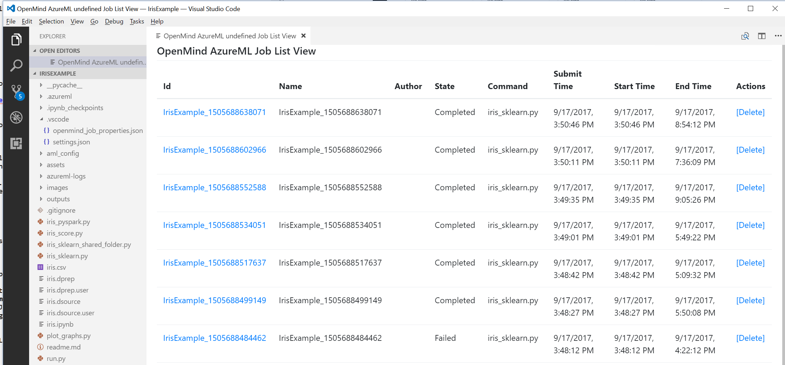

# Visual Studio Code Tools for AI
Visual Studio Code Tools for AI is an extension to build, test, and deploy Deep Learning / AI solutions. It seamlessly integrates with Azure Machine Learning for robust experimentation capabilities, including but not limited to submitting data preparation and model training jobs transparently to different compute targets. Additionally, it provides support for custom metrics and run history tracking, enabling data science reproducibility and auditing. Enterprise ready collaboration, allow to securely work on project with other people.

Get started with deep learning using [Microsoft Cognitive Toolkit (CNTK)](http://www.microsoft.com/en-us/cognitive-toolkit), [Google TensorFlow](https://www.tensorflow.org), or other deep-learning frameworks today.  
 
## Features

###Develop deep learning and AI solutions across Windows, Linux and MacOS
VS Code Tools for AI is a cross-platform extension that supports deep learning frameworks including [Microsoft Cognitive Toolkit (CNTK)](http://www.microsoft.com/en-us/cognitive-toolkit), [Google TensorFlow](https://www.tensorflow.org) and more.  

Because it's an IDE we've enabled familiar code editor features like syntax highlighting, IntelliSense (auto-completion) and text auto formatting. You can interactively test your deep learning application in your local environment using step-through debugging on local variables and models. 

###Find and share examples via the gallery  
Visual Studio Code Tools for AI is integrated with Azure Machine Learning to make it easy to browse through a gallery of sample experiments using CNTK, TensorFlow, MMLSpark and more. This makes it easy to learn and share with others. 

###Scale out deep learning model training and/or inferencing to the cloud
This extension makes it easy to train models on your local computer or you can submit jobs to the cloud by using our integration with Azure Machine Learning. You can submit jobs to different compute targets like Spark clusters, Azure GPU virtual machines and more  

## Exploring project samples
Visual Studio Code Tools for AI comes with a Sample Explorer. The Sample Explorer makes it easy to discover samples and try them with only a few clicks. 

To open the explorer, do as follow:   
1. Open the command palette (View > **Command Palette** or **Ctrl+Shift+P**).
2. Enter "ML Sample". 
3. You get a recommendation for "Machine Learning: Open Azure Machine Learning Samples Explorer", select it and press enter. 

## Creating a new project from the sample explorer 
You can browse different samples and get more information about them. Let's browse until finding the "Classifying Iris" sample.

 
To create a new project based on this sample do the following:
1. Click install button on the project sample, notice the commands being prompted, walking you through the steps of creating a new project. 
2. **Enter a name** for the project, for example "Iris".
3. **Enter a folder** to create your project and press enter. 
4. **Select an existing workspace** and press enter.

The project will then be created.

> [!TIP]
> You will need to be logged-in to access your Azure resource. From the embedded terminal enter "az login" and follow the instruction. 

## Submitting a job to train your model locally or in the cloud
Now that the new project is open in Visual Studio Code, you can submit a model training job to your different compute targets (local or VM with docker).

Visual Studio Code Tools for AI provides multiple ways to submit a model training job. 
1. Context Menu (right click) - **Machine Learning: Submit Job**.
2. From the command palette: "Machine Learning: Submit Job".
3. Alternatively, you can run the command directly using Azure CLI, Machine Learning Commands, using the embedded terminal.

Open iris_sklearn.py, right click and select **Machine Learning: Submit Job**.
1. Select your platform: "Azure Machine Learning".
2. Select your run-configuration: "Docker-Python."

> [!NOTE]
> If it is the first time your submit a job, you receive a message "No Machine Learning configuration found, creating...". A JSON file is opened, save it (**Ctrl+S**).

Once the job is submitted, the embedded-terminal displays the progress of the runs. 

## View recent job performance and details
Once the jobs are submitted, you can list the jobs from the run history.
1. Open the command palette (View > **Command Palette** or **Ctrl+Shift+P**).
2. Enter "**AI List**."
3. You get a recommendation for "AI: List Jobs", select and press enter.
4. Select the platform "Azure Machine Learning."

The Job List View opens and displays all the runs and some related information.

To view the results of a job, click on the **job ID** link to see detailed information. 

# Contributing

This project welcomes contributions and suggestions.  Most contributions require you to agree to a
Contributor License Agreement (CLA) declaring that you have the right to, and actually do, grant us
the rights to use your contribution. For details, visit https://cla.microsoft.com.

When you submit a pull request, a CLA-bot will automatically determine whether you need to provide
a CLA and decorate the PR appropriately (e.g., label, comment). Simply follow the instructions
provided by the bot. You will only need to do this once across all repos using our CLA.

This project has adopted the [Microsoft Open Source Code of Conduct](https://opensource.microsoft.com/codeofconduct/).
For more information see the [Code of Conduct FAQ](https://opensource.microsoft.com/codeofconduct/faq/) or
contact [opencode@microsoft.com](mailto:opencode@microsoft.com) with any additional questions or comments.

# Legal Notices

Microsoft and any contributors grant you a license to the Microsoft documentation and other content
in this repository under the [Creative Commons Attribution 4.0 International Public License](https://creativecommons.org/licenses/by/4.0/legalcode),
see the [LICENSE](LICENSE) file, and grant you a license to any code in the repository under the [MIT License](https://opensource.org/licenses/MIT), see the
[LICENSE-CODE](LICENSE-CODE) file.

Microsoft, Windows, Microsoft Azure and/or other Microsoft products and services referenced in the documentation
may be either trademarks or registered trademarks of Microsoft in the United States and/or other countries.
The licenses for this project do not grant you rights to use any Microsoft names, logos, or trademarks.
Microsoft's general trademark guidelines can be found at http://go.microsoft.com/fwlink/?LinkID=254653.

Privacy information can be found at https://privacy.microsoft.com/en-us/

Microsoft and any contributors reserve all others rights, whether under their respective copyrights, patents,
or trademarks, whether by implication, estoppel or otherwise.
