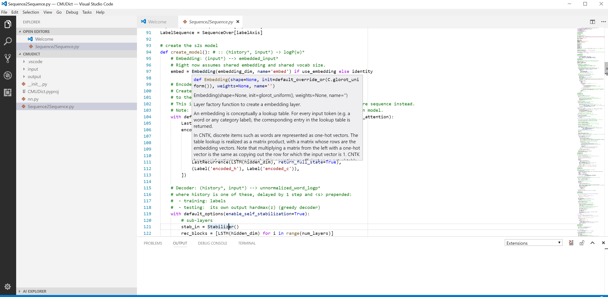
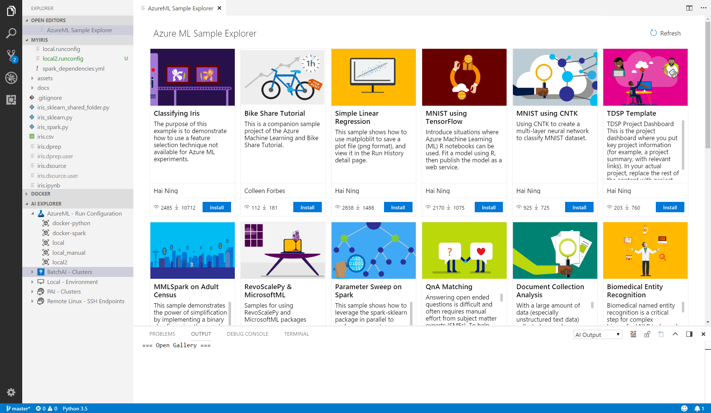
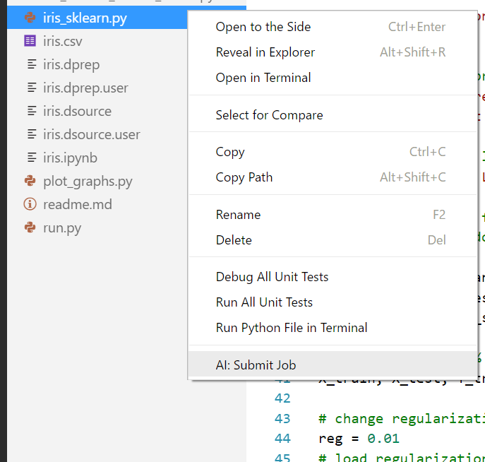

# Visual Studio Code Tools for AI
Visual Studio Code Tools for AI is an extension to build, test, and deploy Deep Learning / AI solutions. It seamlessly integrates with Azure Machine Learning for robust experimentation capabilities, including but not limited to submitting data preparation and model training jobs transparently to different compute targets. Additionally, it provides support for custom metrics and run history tracking, enabling data science reproducibility and auditing. Enterprise ready collaboration, allow to securely work on project with other people.

Get started with deep learning using [Microsoft Cognitive Toolkit (CNTK)](http://www.microsoft.com/en-us/cognitive-toolkit), [Google TensorFlow](https://www.tensorflow.org), or other deep-learning frameworks today.  
 
## Features

### Develop deep learning and AI solutions across Windows and MacOS
VS Code Tools for AI is a cross-platform extension that supports deep learning frameworks including [Microsoft Cognitive Toolkit (CNTK)](http://www.microsoft.com/en-us/cognitive-toolkit), [Google TensorFlow](https://www.tensorflow.org) and more.  

Because it's an IDE we've enabled familiar code editor features like syntax highlighting, IntelliSense (auto-completion) and text auto formatting. You can interactively test your deep learning application in your local environment using step-through debugging on local variables and models. 

### Find and share examples via the gallery  
Visual Studio Code Tools for AI is integrated with Azure Machine Learning to make it easy to browse through a gallery of sample experiments using CNTK, TensorFlow, MMLSpark and more. This makes it easy to learn and share with others. 

### Scale out deep learning model training and/or inferencing to the cloud
This extension makes it easy to train models on your local computer or you can submit jobs to the cloud by using our integration with Azure Machine Learning. You can submit jobs to different compute targets like Spark clusters, Azure GPU virtual machines and more  

## Exploring project samples
Visual Studio Code Tools for AI comes with a Sample Explorer via integration with Azure Machine Learning. The Sample Explorer makes it easy to discover samples and try them with only a few clicks. 

> [!TIP]
> You will need Azure Machine Learning Workbench to be installed. See instructions at [How to install Azure Machine Learning Workbench](https://docs.microsoft.com/en-us/azure/machine-learning/preview/quickstart-installation)  

To open the explorer, do as follow:   
1. Open the command palette (View > **Command Palette** or **Ctrl+Shift+P**).
2. Enter "ML Sample". 
3. You get a recommendation for "AI: Open Azure ML Sample Explorer", select it and press enter. 

## Creating a new project from the sample explorer 
You can browse different samples and get more information about them. Let's browse until finding the "Classifying Iris" sample.

 
To create a new project based on this sample do the following:
1. Click install button on the project sample, notice the commands being prompted, walking you through the steps of creating a new project. 
2. **Enter a name** for the project, for example "Iris".
3. **Select an account**
4. **Select a workspace** and press enter.
5. **Select a project folder** to create your project

The project will then be created.

> [!TIP]
> You will need to be logged-in to access your Azure resource. Right click the "Azure ML" node in AI EXPLORER and click "AI: Azure ML - Login" to start.

## Submitting a job to train your model locally or in the cloud
Now that the new project is open in Visual Studio Code, you can submit a model training job to your different compute targets (local or VM with docker).

Visual Studio Code Tools for AI provides multiple ways to submit a model training job. 
1. Context Menu (right click) - **AI: Submit Job**.
2. From the command palette: "AI: Submit Job".
3. Alternatively, you can run the command directly using Azure CLI, Machine Learning Commands, using the embedded terminal.

Open iris_sklearn.py, right click and select **AI: Submit Job**.
1. Select your platform: "Azure Machine Learning".
2. Select your run-configuration: "Docker-Python."

Once the job is submitted, the embedded-terminal displays the progress of the runs. 

## View recent job performance and details
Once the jobs are submitted, you can list the jobs from the run history.
1. Open the command palette (View > **Command Palette** or **Ctrl+Shift+P**).
2. Enter "**AI List**."
3. You get a recommendation for "AI: List Jobs", select and press enter.
4. Select the platform "Azure Machine Learning."

The Job List View opens and displays all the runs and some related information.

To view the results of a job, click on the **job ID** link to see detailed information. 

# Using
- First, install [Visual Studio Code](http://code.visualstudio.com/) then install **Tools for AI** extension by pressing **F1** or **ctrl+shift+p** to open command palette, select **Install Extension** and type **tools for AI**. 

# Commands
The extension provides several commands in the Command Palette for working with deep learning and machine learning:
- **AI: List Jobs**: View list of recent jobs you've submitted and their details
- **AI: Open Azure ML Sample Explorer**: Quickly get started with machine learning and deep learning experimentation by downloading sample projects you can run and modify to meet your needs 
- **AI: Azure ML - Set Subscription**:  Set your Azure Subscription to use for Azure Machine Learning experimentation 
- **AI: Azure ML - Open Terminal**: Open Azure CLI terminal to access full Azure feature set
- **AI: Add Platform Configuration**: Configure Azure Machine learning compute target

# Supported Operating Systems
Currently this extension supports the following 64-bit operating systems:
- Windows
- macOS

# Preparing your environment

Before training deep learning models on your local or remote computer you should make sure you have the latest applicable prerequisites installed. This includes making sure the latest drivers and libraries for your NVIDIA GPU (if you have one). You should also ensure you have installed Python and Python libraries such as NumPy, SciPy, Python support for Visual Studio Code, and appropriate deep learning frameworks such as Microsoft Cognitive Toolkit (CNTK), TensorFlow, Caffe2, MXNet, Keras, Theano, PyTorch and/or Chainer.

Please visit [here](https://github.com/Microsoft/vs-tools-for-ai/blob/master/docs/prepare-localmachine.md) for detailed instruction.

# Support
Support for this extension is provided on our [GitHub Issue Tracker](http://github.com/Microsoft/vscode-tools-for-ai/issues). You can submit a bug report, a feature suggestion or participate in discussions.

## Code of Conduct
This project has adopted the [Microsoft Open Source Code of Conduct]. For more information see the [Code of Conduct FAQ] or contact [opencode@microsoft.com] with any additional questions or comments.

## Privacy Statement
The [Microsoft Enterprise and Developer Privacy Statement] describes the privacy statement of this software.

## License
This extension is subject to the terms of the [End User License Agreement](https://www.visualstudio.com/license-terms/mlt552233/). 

[Microsoft Enterprise and Developer Privacy Statement]:https://go.microsoft.com/fwlink/?LinkId=786907&lang=en7
[Microsoft Open Source Code of Conduct]:https://opensource.microsoft.com/codeofconduct/
[Code of Conduct FAQ]:https://opensource.microsoft.com/codeofconduct/faq/
[opencode@microsoft.com]:mailto:opencode@microsoft.com
