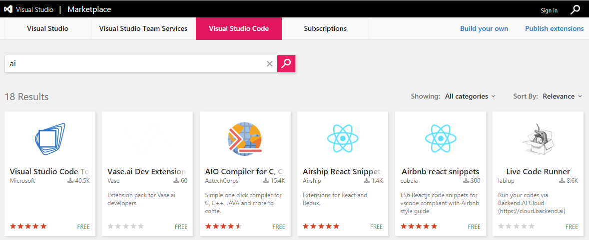
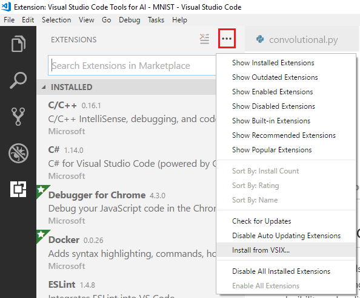

## DEPRECATED DOC- This extension has been re-designed to focus on providing a great experience working with the Azure Machine Learning service. Please check out the latest doc in the [parent folder](..).

# Installing Visual Studio Code Tools for AI

This extension works with [Visual Studio Code](https://code.visualstudio.com/). 

To install, download from the [Visual Studio Code MarketPlace] or from within Visual Studio Code.

**When downloading, the package file name may incorrectly end with ".zip".
Please save it as ".vsix" and then install locally.**

## From within Visual Studio Code

1. Bring up the **Extensions** view by clicking on the Extensions icon in the **Activity Bar** on the side of VS Code or the **View > Extensions** command (**Ctrl+Shift+X**).

2. **Search** in upper right-hand corner for "Visual Studio Code Tools for AI".

3. Click the **Intall** button and after a successful install, you'll see an **Reload** button which will prompt you to restart VS Code to enable the extension.

## Install from [Visual Studio Code MarketPlace]
1. Go to [Visual Studio Code MarketPlace] and search for "Visual Studio Code Tools for AI" in the search box.

2. Click **"Visual Studio Code Tools for AI"** item to navigate to the item detail page.

3. Click **Install**, a dialog will pop up to confirm whether VS Code is installed, install VS Code if you do not have it installed.

4. Visual Studio Code Tools for AI extension page will be load after step 3. Click the **Intall** button and after a successful install, you'll see an **Reload** button which will prompt you to restart VS Code to enable the extension.

## Download Extensions and Install Later from [Visual Studio Code MarketPlace]
If you are in a slow network connection, and would like to install the extension later. You can try the following steps.
1. Go to [Visual Studio Code MarketPlace] and search for "Visual Studio Code Tools for AI" in the search box.

2. Click **"Download Extension"** to download the extension package to your local disk.

4. In Visual Studio Code, choose **EXTENSIONS:Install from VSIX...** and open the vsix file you just downloaded to install it.
You can also enter "vsix" in **Command Palette** (**Ctrl+Shift+P**) to execute this command.

[Visual Studio Code MarketPlace]:https://marketplace.visualstudio.com/vscode