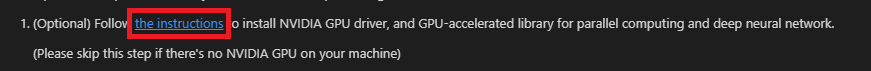

## DEPRECATED DOC- This extension has been re-designed to focus on providing a great experience working with the Azure Machine Learning service. Please check out the latest doc in the [parent folder](..).
# Installation Page

We provide `Tools for AI Installation Page` to help users setup AI dependent environment.

After our extension first time installation, this page would be auto-opened.

Or you could use command `AI: Open Tools for AI Installation Page` to open this page.

## Install NVIDIA GPU Driver

In the first step, we provide an instruction to help users install the NVIDIA GPU Driver.

If there is no NVIDIA GPU on your machine, please skip this step.

Otherwise, please follow the instruction to install the driver.

## Install dependent Environment

In the second step, we provide an python script to help users install the dependent environment.

We use `python.pythonPath` in the `User Settings` as the python interpreter.

If the configuration is not set, we use `python` as default, which would use the first python interpreter in your `PATH` environment variable.

You could use command `Python: Select Interpreter` to set the `python.pythonPath` when no folder is opened.

Or you could use command `Preferences: Open User Settings` to open `User Settings` and add `"python.pythonPath": "/path/to/python"` configuration in `User Settings` tab.

If the python interpreter is installed in a system folder, please check the checkbox box below to run the script as Administrator.

