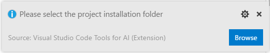
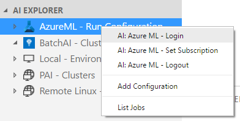
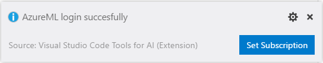

## DEPRECATED DOC- This extension has been re-designed to focus on providing a great experience working with the Azure Machine Learning service. Please check out the latest doc in the [parent folder](..).
# Quickstart: create an AI project from Azure Marchine Learning Gallery in Visual Studio Code

## Exploring project samples
Visual Studio Code Tools for AI comes with a Sample Explorer via integration with Azure Machine Learning. The Sample Explorer makes it easy to discover samples and try them with only a few clicks. 

> [!TIP]
> You will need Azure Machine Learning Workbench to be installed. See instructions at [How to install Azure Machine Learning Workbench][1]

To open the explorer, do as follow:   
1. Open the command palette (View > **Command Palette** or **Ctrl+Shift+P**).
2. Enter "ML Sample". 
3. You get a recommendation for "AI: Open Azure ML Sample Explorer", select it and press enter. 

## Creating a new project from the sample explorer
You can browse different samples and get more information about them. Let's browse until finding the "Classifying Iris" sample.

To create a new project based on this sample do the following:
1. Click install button on the project sample, notice the commands being prompted, walking you through the steps of creating a new project. 
2. **Enter a name** for the project, for example "Iris".
3. **Select an account**
4. **Select a workspace**
5. **Select a project folder** to create your project

The project will then be created in the specified folder.

> [!TIP]
> You will need to be logged-in to access your Azure resource.

## Login to access Azure ML resource
To login , please right click the **"Azure ML"** node in **AI EXPLORER** and click **"AI: Azure ML - Login"** to start.
You can also execute command **"AI: Azure - Login"** in **Command Palette**.

Then please follow the instructions on screen to finish login process.
1. Azure device login

2. Set subscription

> [!TIP]
> You will need to finish the login process within 300 seconds.

[1]:https://docs.microsoft.com/en-us/azure/machine-learning/preview/quickstart-installation