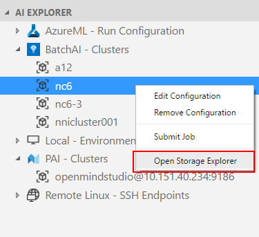
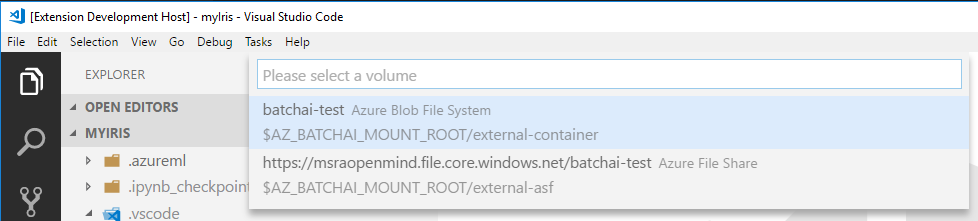
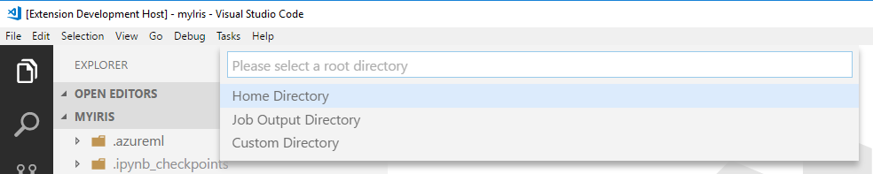

## DEPRECATED DOC- This extension has been re-designed to focus on providing a great experience working with the Azure Machine Learning service. Please check out the latest doc in the [parent folder](..).
# Manage remote storage
Visual Studio Code Tools for AI comes with a **Storage Explorer**.

You can manage the storage on **PAI** clusters and **Remote Linux** VMs within VS Code. Storage Explorer supports creating/deleting/uploading/download files and folders.


## Launch the storage explorer
There are two ways to open the Storage Explorer.
1. Context menu of AI EXPLORER nodes.

    

2. Executing the command ***AI: Open Storage Explorer*** from Command Palette (Ctrl+Shift+P).

    Depends on which way you use and which platform you chose, you may need to provide more information. For example, the cluster node/remote machine, the storage volumn, or the root directory, etc.

    

    

## Folder / File operations
To make changes on remote storage, right click the target node in Storage Explorer and use the context menu.

* For **File** node, "Download" and "Delete" are supported.
* For **Folder** node, supported operations are listed below:
```
Upload         # Upload a file.
Upload Folder  # Upload all contents under specified folder recursively.
Download       # Download a file / folder to local disk. If a folder is specified, all contents under this folder will be downloaded recursively.
New Folder     # Create a sub folder under specified folder.
Delete         # Delete a file / folder. If a folder is specified, it will be deleted recursively.
```

Once a file is downloaded, you can choose to preview it in VS Code window or jump to its location on local disk in message window:

