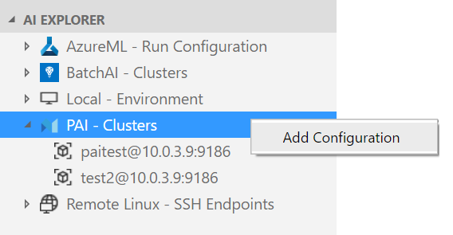
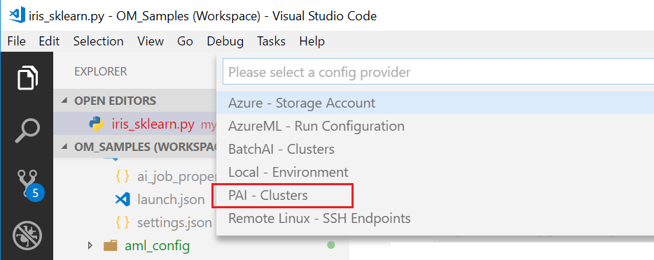
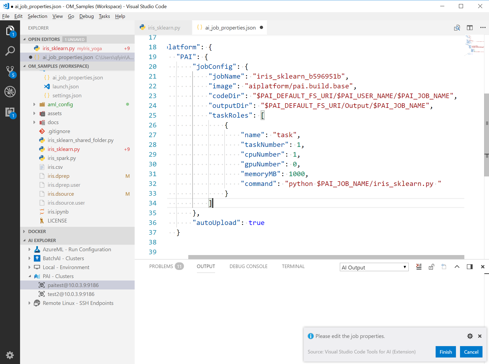

## DEPRECATED DOC- This extension has been re-designed to focus on providing a great experience working with the Azure Machine Learning service. Please check out the latest doc in the [parent folder](..).
# Training AI models in PAI

[PAI(Platform for AI)](https://github.com/Microsoft/pai) is a cluster management tool and resource scheduling platform, jointly designed and developed by Microsoft Research (MSR) and Microsoft Search Technology Center (STC). The platform incorporates some mature design that has a proven track record in large scale Microsoft production environment, and is tailored primarily for academic and research purpose.

## Add a PAI cluster
To add a PAI cluster, right click **PAI - Clusters** node and select ***Add Configuration***.



Command **AI: Add Platform Configuration** can also be used. Execute this command in **Command Palette** (Ctrl+Shift+P) and then select a config provider:



A configuration file is created and opened in editor window for review.
```json
{
    "username": "username",
    "password": "password",
    "rest_server_uri": "10.0.3.9:9186",
    "webhdfs_uri": "10.0.3.9:50070",
    "grafana_uri": "10.0.3.9:3000",
    "k8s_dashboard_uri": "10.0.3.9:9090"
}
```
Click **Finish** to add a configuration.


## Submit training jobs to a PAI cluster
For detailed guide about general submitting steps, please refer to [Submitting Jobs](./quickstart-01-submitting-training-jobs.md) 

Right click the PAI cluster node in **AI EXPLORER** and select ***AI: Submit Job***


A QuickPick window pops up. Please choose whether to upload script automatically or not:


> [!NOTE]
> For PAI clusters, users can store their scripts and data in cloud storage and specify the path in job properties. In this case, please select **No**.

A new ai-job-properties.json file is then created and opened in editor window for review.



In ***ai-job-properties.json***, PAI-specific job properties are under `platform.PAI.jobConfig`:
```json
    "platform": {
        "PAI": {
            "jobConfig": {
                "jobName": "iris_sklearn_43f7f1a7",
                "image": "aiplatform/pai.build.base",
```

For detailed information about PAI job properties, please refer to the [PAI Job Tutorial](https://github.com/Microsoft/pai/tree/master/job-tutorial)

Click ***Finish*** button to submit the job.

## Check the job status and download its assets
Now the job has been submitted to target PAI cluster. You can check the job status and download its assets via [Job View](quickstart-02-job-view.md). Meanwhile [Storage Explorer](quickstart-03-storage-explorer.md) is also a good place to access the job assets.