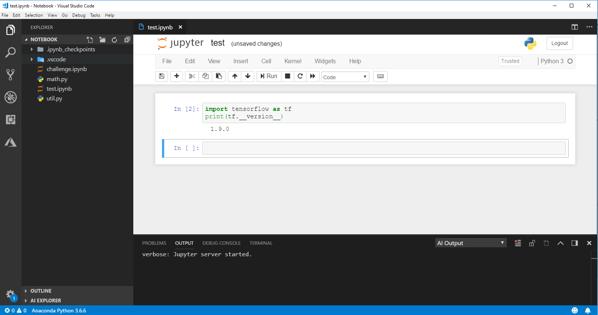

## DEPRECATED DOC- This extension has been re-designed to focus on providing a great experience working with the Azure Machine Learning service. Please check out the latest doc in the [parent folder](..).
# Open Jupyter notebooks in VS Code
In this tutorial, we will open a Jupyter notebook in VS Code window.

## Prerequisites
Before you begin, ensure you have [set Python path properly in VS Code](https://code.visualstudio.com/docs/python/environments) and have already [installed Jupyter in this Python path with pip](http://jupyter.org/install).

## Open a project

- Launch Visual Studio Code and select ***File > Open Folder*** (Ctrl+K Ctrl+O)
- Select a folder which contains the Jupyter notebook file (.pynb) you want to open.

## Select command in context menu

Right click the Jupyter notebook file node and select **"AI: View in Jupyter Server"** command.

## View and edit in VS Code editor

After clicking the command, a Jupyter server will start and show in editor window. You could view, edit and save your changes back to the file. 

