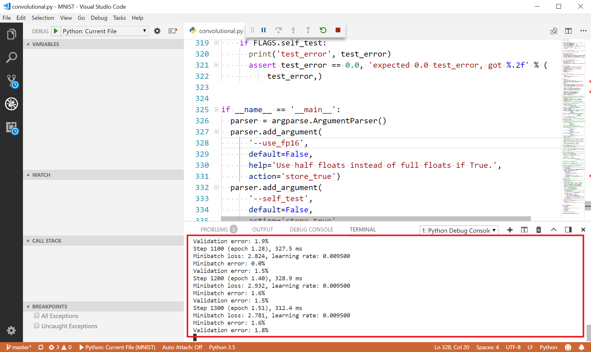

## DEPRECATED DOC- This extension has been re-designed to focus on providing a great experience working with the Azure Machine Learning service. Please check out the latest doc in the [parent folder](..).
# Train a TensorFlow model locally 

In this quickstart, we will run a TensorFlow model with the [MNIST](http://yann.lecun.com/exdb/mnist/) dataset locally in AI Tools. 
The MNIST database has a training set of 60,000 examples, and a test set of 10,000 examples of handwritten digits. 

## Prerequisites

Before you begin, ensure you have the following installed:

### Google TensorFlow 

Run the following command in a terminal. 


```cmd
pip install tensorflow
```

or if you have an Nvidia GPU

```cmd
pip install tensorflow-gpu
```

### NumPy and SciPy 
run the following command in a terminal:
```cmd
pip install numpy scipy
``` 

### Download sample code
Download this [GitHub repository](https://github.com/Microsoft/samples-for-ai) containing samples for getting started with deep learning across TensorFlow, CNTK, Theano and more. 

## Open a project and train model 

- Launch Visual Studio Code and select ***File > Open Folder*** (Ctrl+K Ctrl+Of)
- Select the ***examples\tensorflow\MNIST*** subfolder from your local samples repository.

    

- Open `convolutional.py` and press **F5** to start.

    The output will be printed in the terminal window.

    
    
> [!TIP]
> Make sure you've selected correct python environment which has necessary packages (tensorFlow, NumPy, SciPy, etc.) installed.</br>
> Use command ***Python: Select Interpreer*** to select proper Python interpreter. Refers to [Setting Up Python Interpreter](prepare-localmachine.md#Setting-up-the-Python-interpreter) for detailed information.

## See Also
* [Train a TensorFlow model in the cloud](tensorflow-vm.md)
