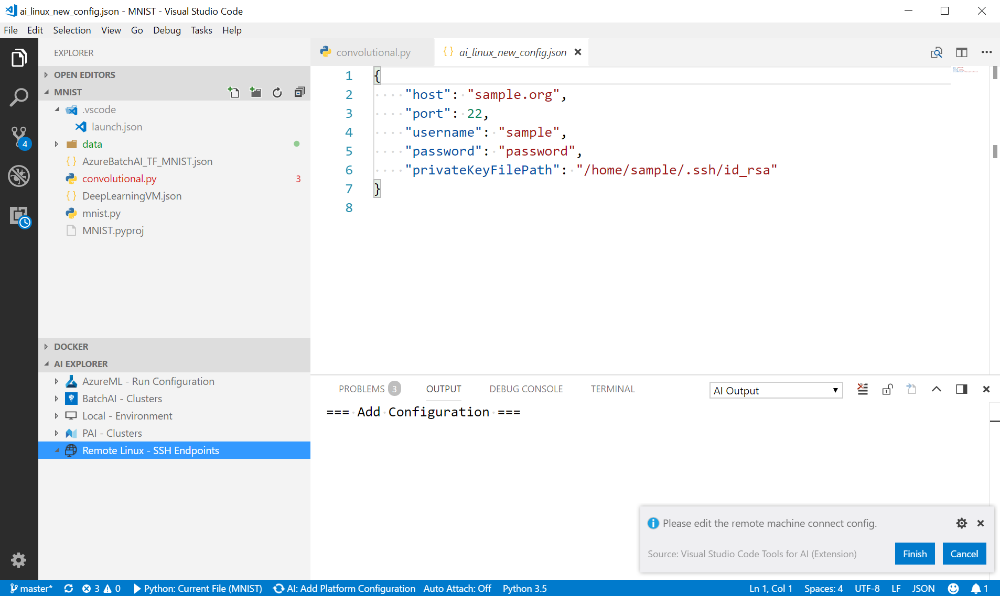
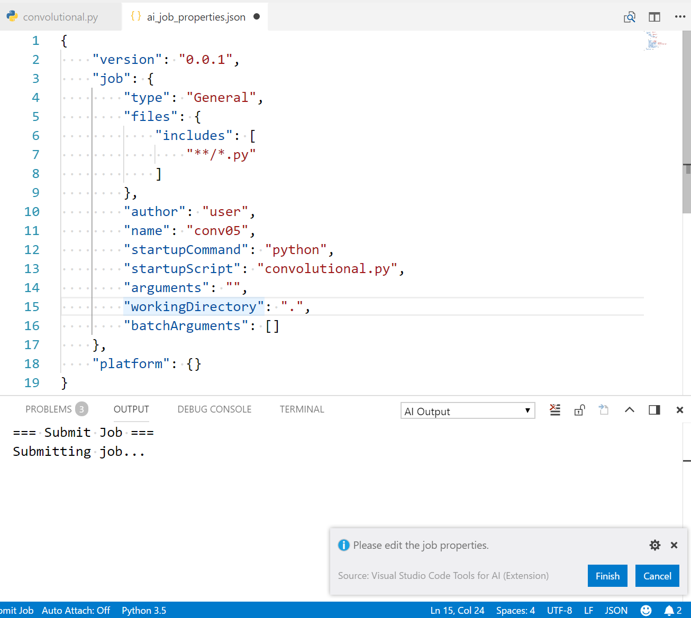

## DEPRECATED DOC- This extension has been re-designed to focus on providing a great experience working with the Azure Machine Learning service. Please check out the latest doc in the [parent folder](..).
# Train a TensorFlow model in the cloud
In this tutorial, we will train a TensorFlow model using the [MNIST dataset](http://yann.lecun.com/exdb/mnist/) in an Azure [Deep Learning Virtual Machine](https://docs.microsoft.com/azure/machine-learning/data-science-virtual-machine/deep-learning-dsvm-overview). 

The MNIST database has a training set of 60,000 examples, and a test set of 10,000 examples of handwritten digits.

## Prerequisites
Before you begin, ensure you have the following installed and configured:

### Download sample code
Download this [GitHub repository](https://github.com/Microsoft/samples-for-ai) containing samples for getting started with deep learning across TensorFlow, CNTK, Theano and more.

### Setup Azure Deep Learning Virtual Machine
Please read instructions for [Setting up Deep Learning Virtual Machine](https://docs.microsoft.com/azure/machine-learning/data-science-virtual-machine/provision-deep-learning-dsvm). 

> [!NOTE] 
> Set **Location** to US West 2 (or others which have Deep Learning VM) and **OS type** as Linux.

### Update .bashrc to Enable Remote Job Submission via Non-interactive Bash Session
Login to your Deep Learning VM using a tool like Putty or similar. Execute below to modify your bashrc file to enable remote deep learning job submission (configures remote behavior to work just like if you logged into the VM).

```bash
echo -e ". /etc/profile\n$(cat ~/.bashrc)" > ~/.bashrc
``` 

## Open a project

- Launch Visual Studio Code and select ***File > Open Folder*** (Ctrl+K Ctrl+Of)
- Select the ***examples\tensorflow\MNIST*** subfolder from your local samples repository.

    

## Add an Azure Remote VM

Right click the **Remote Linux** node in **AI EXPLORER** and select ***Add Configuration***. You can also use command ***AI: Add Platform Configuration*** in command palette.

A new ***ai_linux_new_config.json*** is created and opened in editor window for review. Besides host, port and username, either a password or a private key file is required.



## Submit a job to Azure VM
For detailed guide about general submitting steps, please refer to [Submitting Jobs](./quickstart-01-submitting-training-jobs.md) 

- Open `convolutional.py`
- Right click the Azure VM Node in **AI EXPLORER** and select ***AI: Submit Job***

    

- Review and make necessary modification in created ai_job_properties.json and then click ***Finish*** button to submit the job.

    


## Check the job status and download its assets
To check the status and detail of the job and download its assets, please use [Job View](quickstart-02-job-view.md).

[Storage Explorer](quickstart-03-storage-explorer.md) is also a good place to access the job assets.

## Clean up resources (optional)

Stop the VM if you plan on using it in the near future. If you are finished with this tutorial, run the following command to clean up your resources:

```azure-interactive
az group delete --name myResourceGroup
```