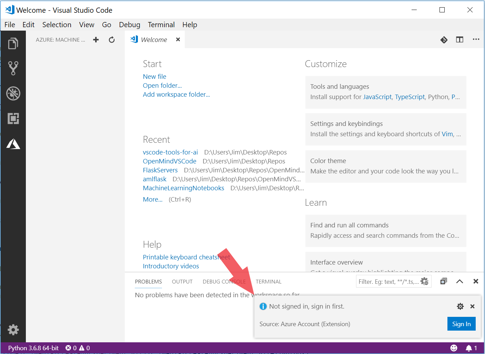

# Get started with Azure Machine Learning for Visual Studio Code

Azure Machine Learning for Visual Studio Code, previously called Visual Studio Code Tools for AI**, is an extension to easily build, train, and deploy machine learning models to the cloud or the edge with Azure Machine Learning service.
** Previous documentation and vsix installer are moved to the archive folder.

In this article, you'll learn how to install the **Azure Machine Learning for Visual Studio Code** extension and create your first experiment with Azure Machine Learning service in Visual Studio Code (VS Code).

## Prerequisite

+ If you don’t have an Azure subscription, create a free account before you begin. Try the [free or paid version of Azure Machine Learning service](http://aka.ms/AMLFree) today.

+ Visual Studio Code must be installed. VS Code is a lightweight but powerful source code editor that runs on your desktop. It comes with built-in support for Python and more.  [Learn how to install VS Code](https://code.visualstudio.com/docs/setup/setup-overview).

+ [Install Python 3.5 or greater](https://www.anaconda.com/download/).

## Install the Azure Machine Learning for VS Code extension

When you install the **Azure Machine Learning** extension, two more extensions are automatically installed (if you have internet access). They are the [Azure Account](https://marketplace.visualstudio.com/items?itemName=ms-vscode.azure-account) extension and the [Microsoft Python](https://marketplace.visualstudio.com/items?itemName=ms-python.python) extension

To work with Azure Machine Learning, we need to turn VS Code into a Python IDE. Working with [Python in Visual Studio Code](https://code.visualstudio.com/docs/languages/python), requires the Microsoft Python extension, which gets installed with the Azure Machine Learning extension automatically. The extension makes VS Code an excellent IDE, and works on any operating system with a variety of Python interpreters. It leverages all of VS Code's power to provide auto complete and IntelliSense, linting, debugging, and unit testing, along with the ability to easily switch between Python environments, including virtual and conda environments. Check out this walk-through of editing, running, and debugging Python code, see the [Python Hello World Tutorial](https://code.visualstudio.com/docs/python/python-tutorial)

**To install the Azure Machine Learning extension:**

1. Launch VS Code.

1. In a browser, visit: [Azure Machine Learning for Visual Studio Code (Preview)](https://aka.ms/vscodetoolsforai) extension

1. In that web page, click **Install**.

1. In the extension tab, click **Install**.

1. A welcome tab opens in VS Code for the extension and the Azure symbol is added to activity bar.

   

1. In the dialog box, click **Sign In** and follow the onscreen prompt to authenticate with Azure.

   The Azure Account extension, which was installed along with the Azure Machine Learning for VS Code extension, helps you authenticate with your Azure account. See the list of commands in the [Azure Account extension](https://marketplace.visualstudio.com/items?itemName=ms-vscode.azure-account) page.

> [!Tip]
> Check out the [IntelliCode extension for VS Code (preview)](https://go.microsoft.com/fwlink/?linkid=2006060). IntelliCode provides a set of AI-assisted capabilities for IntelliSense in Python, such as inferring the most relevant auto-completions based on the current code context.

## Azure ML SDK Installation

To make use of the integrated Azure ML features of the extension, install the Azure ML SDK into a Python or Anaconda environment of your choice.
1. Make sure that Python 3.5 or greater is installed and recognized by VS Code. If you install it now, then  restart VS Code and select a Python interpreter using instructions at https://code.visualstudio.com/docs/python/python-tutorial.

1. Install the Azure ML SDK by following the instructions here: https://docs.microsoft.com/en-us/python/api/overview/azure/ml/install?view=azure-ml-py
## Get started with Azure Machine Learning

Before you start training and deploying machine learning models using VS Code, you need to create an [Azure Machine Learning service workspace](concept-azure-machine-learning-architecture.md#workspace) in the cloud to contain your models and resources. Learn how to create one and create your first experiment in that workspace.

1. Click the Azure icon in the Visual Studio Code activity bar. The Azure Machine Learning sidebar appears.

   

1. Right-click your Azure subscription and select **Create Workspace**. A list appears. In the animated image, the subscription name is 'Free Trial' and the workspace is 'TeamWorkspace'.

1. Select an existing resource group from the list or create a new one using the wizard in the Command Palette.

1. In the field, type a unique and clear name for your new workspace. In the screenshots, the workspace is named 'TeamWorkspace'.

1. Hit enter and the new workspace is created. It appears in the tree below the subscription name.

1. Right-click on the Experiment node and choose **Create Experiment** from the context menu.  Experiments keep track of your runs using Azure Machine Learning.

1. In the field, enter a name your experiment. In the screenshots, the experiment is named 'MNIST'.

1. Hit enter and the new experiment is created. It appears in the tree below the workspace name.

1. You can right-click on an Experiment in a Workspace and select 'Set as Active Experiment'. The **'Active'** experiment is the experiment you are currently using and your open folder in VS Code will be linked to this experiment in the cloud. This folder should contain your local Python scripts.

   Now each of your runs will be associated with the active experiment, so all of your key metrics will be stored in the experiment history and the models you train will get automatically uploaded to Azure Machine Learning and stored with your experiment metrics and logs.

   

## Next steps
- To learn how to create and manage compute resources in Azure Machine Learning from within VS Code, see [Create and manage compute targets in Visual Studio Code](manage-compute-aml-vscode.md)
- To learn how to train models and manage your experiments from Visual Studio Code, see [Training models and managing experiments in Visual Studio Code](train-models-aml-vscode.md)
- To learn how to deploy and manage models from Visual Studio Code, see [Deploying and managing models in Visual Studio Code](deploy-models-aml-vscode.md)
