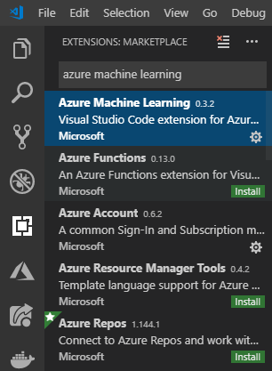
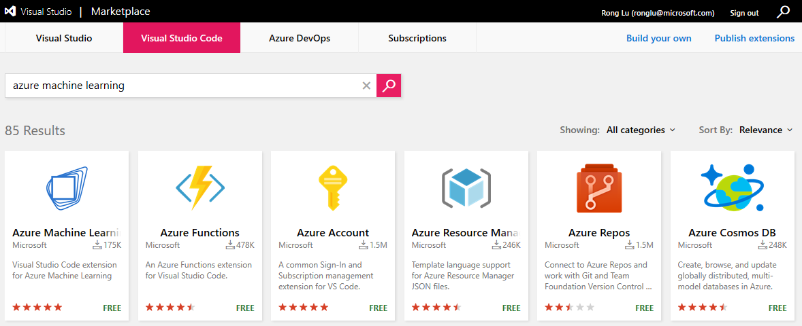
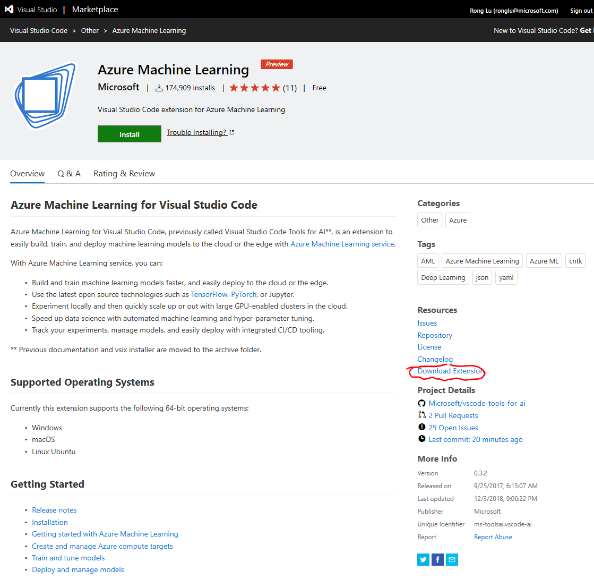
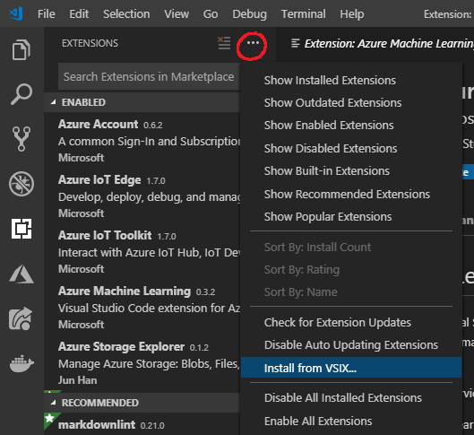

# Visual Studio Code Tools for AI 설치하기

이 익스텐션(extension)은 [Visual Studio Code](https://code.visualstudio.com/)에서 작동합니다. 

[Visual Studio Code MarketPlace]에서 내려 받거나 Visual Studio Code 자체내에서 설치하는 방법이 있습니다.

**내려받을 때, 패키지 파일 명이 ".zip"로 잘못 저장될 수 있습니다.
꼭 ".vsix"로 저장하신 후에 로컬에서 설치하시기 바랍니다.**

## Visual Studio Code 자체내에서 설치하는 방법

1. VS Code 사이드 바에 위치한 **액티비티 바(Activity Bar)** 에 있는 익스텐션 아이콘을 클릭해서 **익스텐션(Extensions)** 보기를 해주시거나 **보기(View) > 익스텐션(Extensions)** 을 실행해주세요(**Ctrl+Shift+X**).

2. **검색(Search)** 에서 "Visual Studio Code Tools for AI"를 찾아주세요.

3. **설치(Install)** 버튼을 누른 뒤 성공적으로 설치가 되면, **재시작(Reload)** 버튼이 활성화되고 프롬프트로 VS Code를 다시 시작해서 익스텐션(extention)이 활성화 되도록 할 겁니다.

## [Visual Studio Code MarketPlace]에서 설치하기
1. [Visual Studio Code MarketPlace]으로 이동 후 검색창에서 "Visual Studio Code Tools for AI"를 검색합니다.

2. **"Visual Studio Code Tools for AI"** 항목을 클릭해서 해당 아이템의 상세 페이지로 이동합니다.

3. **설치(Install)** 를 클릭하면 VS Code가 설치되었는 지를 확인하는 대화창이 팝업으로 뜨게 되며, VS Code를 설치합니다.

4. 위 3단계를 마치면 Visual Studio Code Tools for AI 익스텐션 페이지가 열리며  **설치(Install)** 버튼을 누른 뒤 성공적으로 설치가 되면, **재시작(Reload)** 버튼이 활성화되고 프롬프트로 VS Code를 다시 시작해서 익스텐션(extention)이 활성화 되도록 할 겁니다.

## [Visual Studio Code MarketPlace]에서 익스텐션을 내려받고 나중에 설치하기
네트워크 연결이 느려서 익스텐션을 나중에 설치하고 싶으시다면 다음과 같이 하시면 됩니다.
1. [Visual Studio Code MarketPlace]으로 이동 후 검색창에서 "Visual Studio Code Tools for AI"를 검색합니다.

2. **"익스텐션 내려받기(Download Extension)"** 를 클릭하셔서 로컬 디스크에 익스텐션 패키지를 내려받습니다.

4. Visual Studio Code에서 **익스텐션: VSIX에서 설치하기...(EXTENSIONS:Install from VSIX...)** 를 선택하고 설치를 위해 내려받은 vsix file을 엽니다.
또는 **명령 팔레트(Command Palette)** (**Ctrl+Shift+P**)에서 "vsix"를 입력해서 해당 명령을 실행하시며 됩니다.

[Visual Studio Code MarketPlace]:https://marketplace.visualstudio.com/vscode
