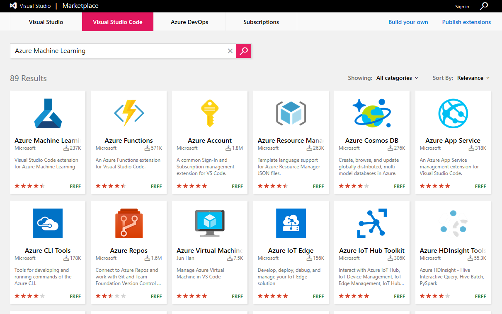
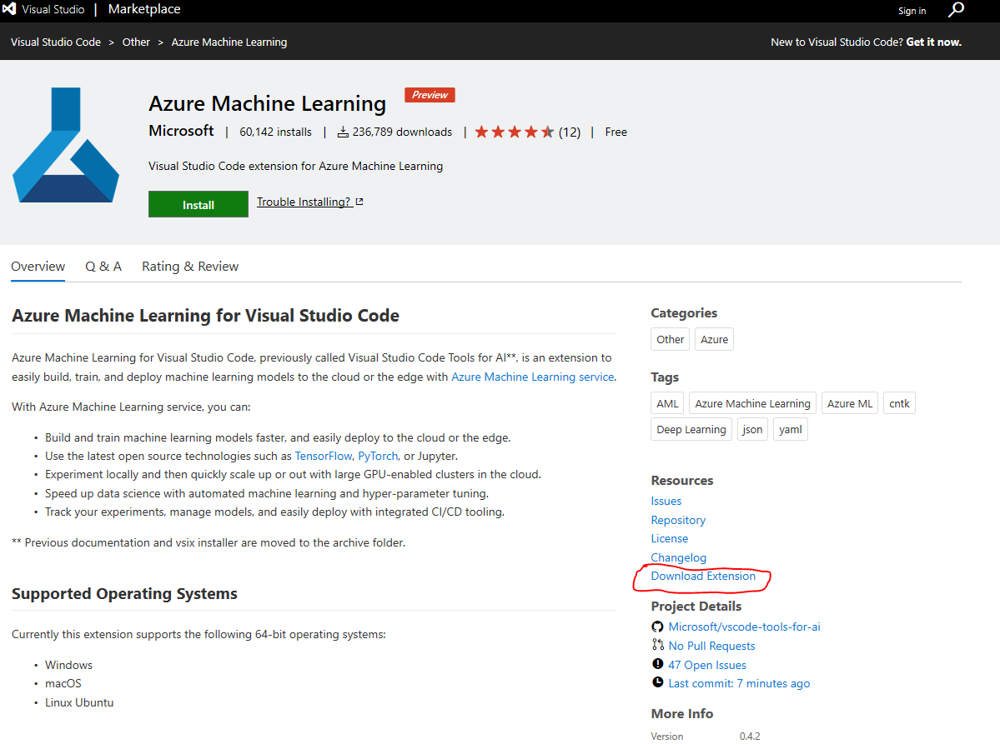

# Install Azure Machine Learning for Visual Studio Code

## 1. Install the Azure Machine Learning for Visual Studio Code extension
There are 3 ways to install:

### Option 1 - Install from within Visual Studio Code (Recommended)

1. Bring up the **Extensions** view in VS Code by clicking on the Extensions icon in the **Activity Bar** on the side of VS Code or the **View > Extensions** command (**Ctrl+Shift+X**).

2. **Search** in upper right-hand corner for "Azure Machine Learning".

3. Click the **Intall** button and after a successful install, you'll see an **Reload** button which will prompt you to restart VS Code to enable the extension.

### Option 2 - Install from [Visual Studio Code MarketPlace]
1. Go to [Visual Studio Code MarketPlace] and search for "Azure Machine Learning" in the search box.

2. Click on the **"Azure Machine Learning"** item to navigate to the item detail page.

3. Click **Install**, a dialog will pop up to confirm whether VS Code is installed, install VS Code if you do not have it installed.

4. Click the **Install** button and after a successful install, you'll see an **Reload** button which will prompt you to restart VS Code to enable the extension.

### Option 3 - Download the installer file from [Visual Studio Code MarketPlace]
If you prefer an offline install or install at a later time, follow these steps.

1. Go to [Visual Studio Code MarketPlace] and search for "Azure Machine Learning" in the search box.

2. Click **"Download Extension"** to download the extension package to your local disk.

3. In Visual Studio Code, choose **EXTENSIONS:Install from VSIX...** and open the vsix file you just downloaded to install it.
You can also enter "vsix" in **Command Palette** (**Ctrl+Shift+P**) to execute this command.

[Visual Studio Code MarketPlace]:https://marketplace.visualstudio.com/vscode

