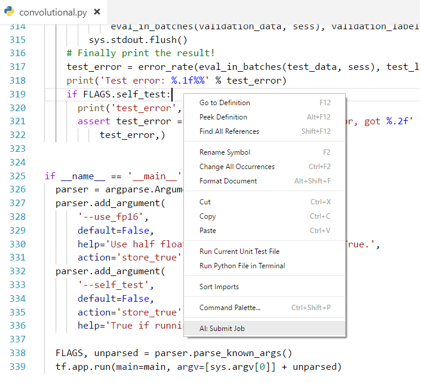
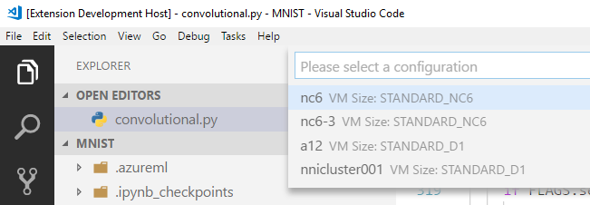
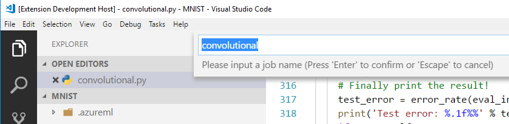
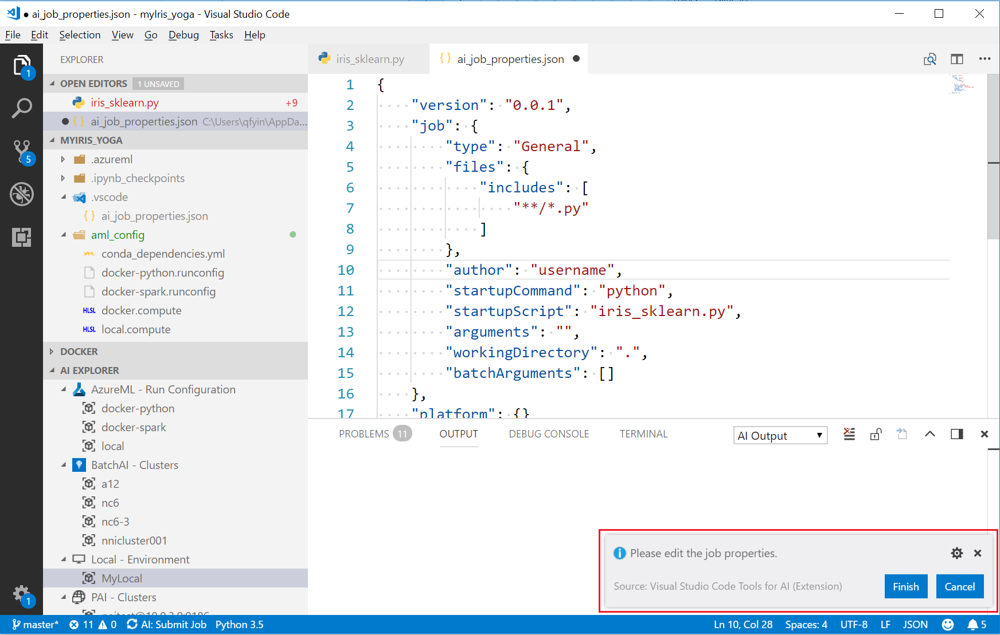

# Submitting a job to train your model locally or in the cloud
Now that the new project is open in Visual Studio Code, you can submit a model training job to your different compute targets. (local or VM with docker).

Visual Studio Code Tools for AI provides multiple ways to submit a model training job. 
* Context Menu (right click) in Explorer view - **AI: Submit Job**.

    

* Context Menu (right click) in active document window - **AI: Submit Job**.

    

* Context Menu (right click) in AI EXPLORER - **AI: Submit Job**.

    

* From the command palette: "AI: Submit Job".

The typical job submitting flow consists of several steps:
1. Select a platform (job service)

    

2. Select a configuration

    

3. Enter a job name
    
    By default the startup script name is used as the job name.
    
    

4. Confirm the job properties

Once all necessary information are collected, a json file ***ai_job_properties.json*** will be created and opened in editor window. You can review and modify the job properties here. To submit the job, click **Finish** button. Click **Cancel** to cancel the job.



By default, job property file is not always be opened for review. You can change this behavior by adding
```json
"ai.submission.always-open-jobproperties": true 
```
to VS Code User Settings (CTRL+comma).

> [!NOTE]
> The steps varies slightly depends on how you launch the command and the target platform you chose. 
> Before you submitting the job, please open a python script file which will be used as startup script.
> You can confirm/change the start script setting later by editing the job property file.

Once the job is submitted, the embedded-terminal displays the progress of the runs. 