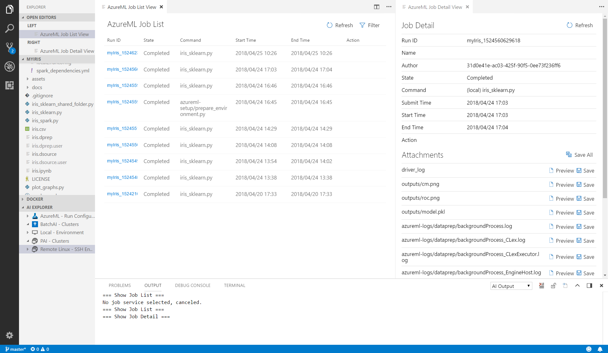

# View recent job performance and details
Once the jobs are submitted, you can list the jobs from the run history.

1. Open the command palette (View > **Command Palette** or **Ctrl+Shift+P**).
2. Enter "**AI List**."
3. You get a recommendation for "AI: List Jobs", select and press enter.
4. Select the platform "Azure Machine Learning."

The Job List View opens and displays all the runs and some related information.

To view the results of a job, click on the **job ID** link to see detailed information. 