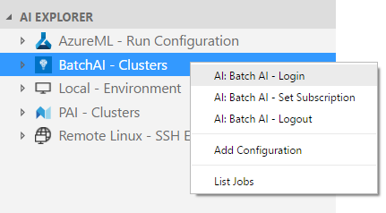
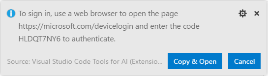
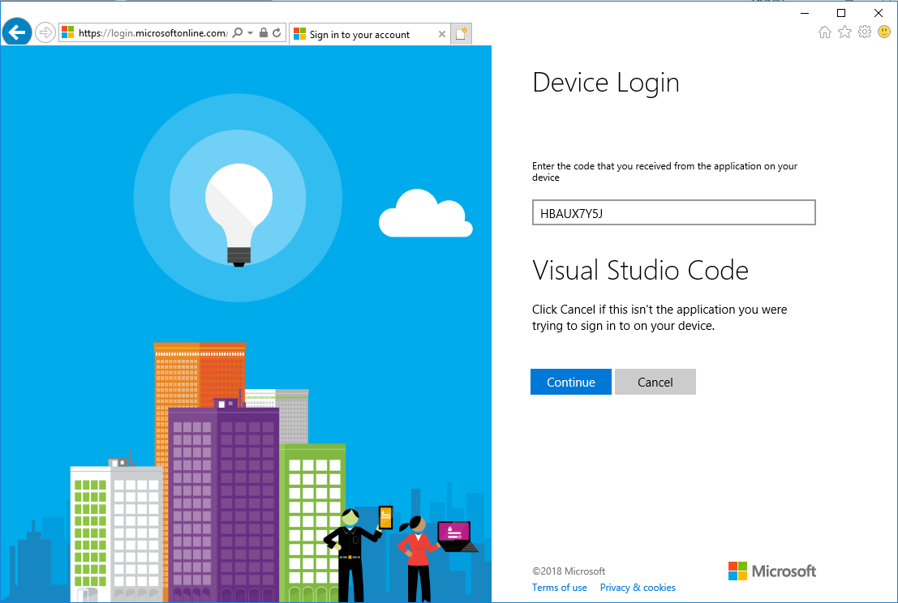
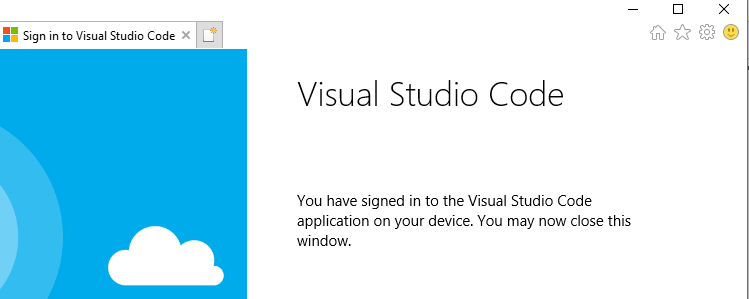
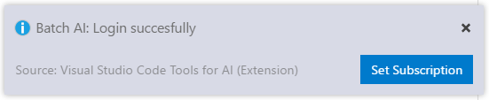
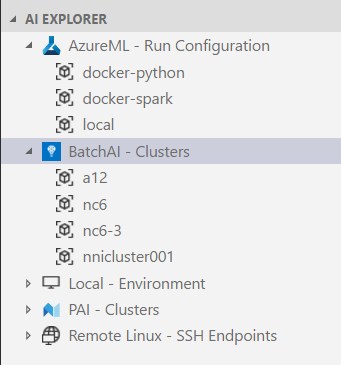
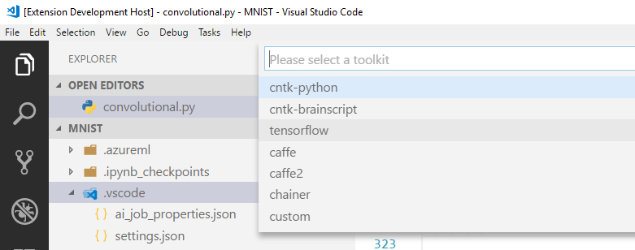
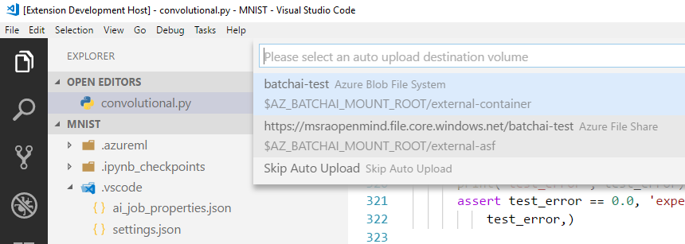
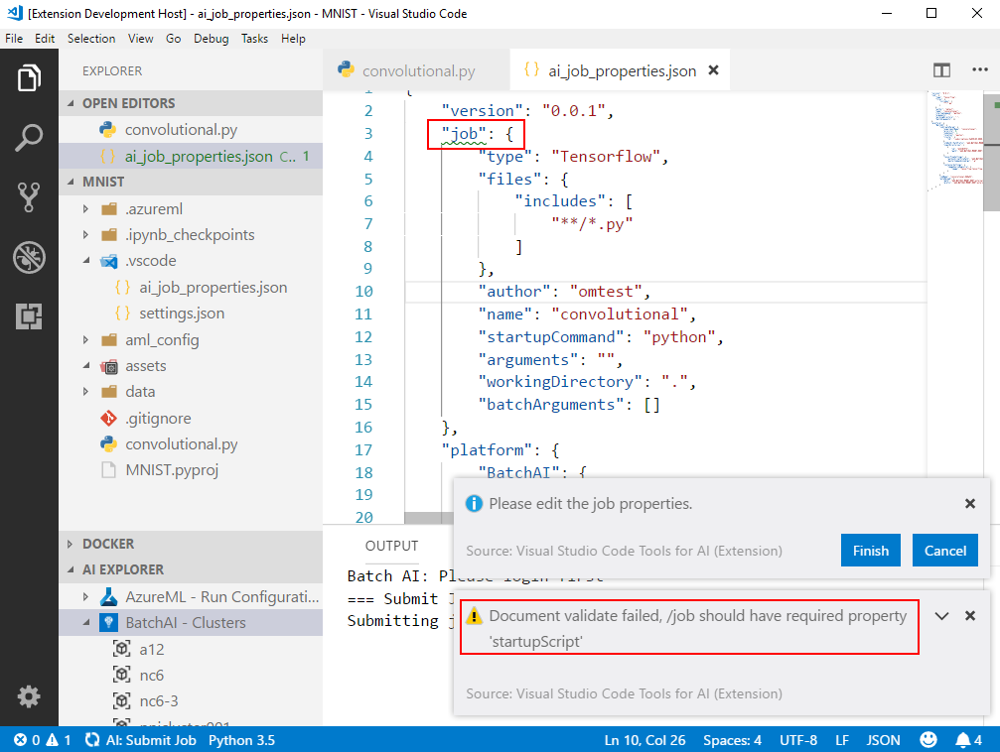

# Training AI models in Azure Batch AI

Batch AI is a managed service that enables data scientists and AI researchers to train AI and other machine learning models on clusters of Azure virtual machines, including VMs with GPU support. You describe the requirements of your job, where to find the inputs and store the outputs, and Batch AI handles the rest. [Learn more about Azure Batch AI][https://docs.microsoft.com/en-us/azure/batch-ai/overview) 

It's integrated with Visual Studio Tools for AI so you can dynamically scale out training models in Azure.  Once you've [installed Visual Studio Tools for AI](installation.md), it's easy to create a new Python project using pre-made recipes in the Azure Machine Learning Sample Gallery.

## Login to Azure
In order to training models on Batch AI clusters, you should have a valid Azure Subscription and resource group.
Please login first to access related resources.

Azure Login involves two steps: **Login** and **Set Subscription**

1. Right click the "BatchAI" node in **AI EXPLORER**, click ***AI: BatchAI - Login***. You can also execute ***AI: Azure - Login*** in Command Palette (Ctrl+Shift+P).

    

    Then click **Copy & Open** button to continue with the standard Azure device login process.

    

    A browser window pops up. Paste the code to the textbox and follow the instructions.

    
    
    When you see this page, you've successfully logged in to Azure.

    

2. Once logged in to Azure, a message window pops up which asks you to **Set Subscription**.

    

    Click **Set Subscription** button to select a proper Azure subscription.

    

    The clusters under selected subscription are listed in AI EXPLORER.

    
    
    > [!TIP]
    > If you want to change the subscription later, use the context menu or command ***AI: Azure - Set Subscription***

## Manage storage on Batch AI cluster
Right click the **BatchAI** cluster node in AI EXPLORER and click ***Open Storage Explorer***.
You can also execute the command ***AI: Open Storage Explorer*** from Command Palette (Ctrl+Shift+P).

Please refer to [Manage Remote Storage](quickstart-03-storage-explorer.md) for details.

## Train models on a BatchAI cluster
Suppose you already have an AI project. Open it in VS Code.

> [!TIP]
> [Samples for AI](https://github.com/Microsoft/samples-for-ai) might be a good start point. 
> Clone the sample projects from `https://github.com/Microsoft/samples-for-ai.git`

You can run/debug the python code locally. You can also submit training jobs to different compute targets.

Please refer to [Submitting Training Jobs](quickstart-01-submitting-training-jobs.md) for details.

Here we submit a training job to BatchAI cluster step by step.
1. Open the main script and right click the editor window to execute the ***AI: Submit Job*** in context menu.

	

2. Select **Azure Batch AI** as the job service.

	

3. Select a proper BatchAI cluster.

	.png)

4. Enter a job name.

	.png)

5. Select a toolkit.
    Select a proper tooltik which your project depends on. This affects the setting of container on the BatchAI cluster.
	
    .png)

6. Select a volumn
    There might be multiple storages mounted to a BatchAI cluster. To upload the script to BatchAI cluster, please select a volumn here. Script will be uploaded and stored to this volumn. You can change the path in `ai_job_properties.json` later.

    .png)

7. Confirm the job properties
    All necessary information are collected and a json file `ai_job_properties.json` will be created and opened in editor window.

    You get an opportunity to review and edit the job . To submit the job, click **Finish** button. Click **Cancel** to cancel the job.

    

    > [!TIP]
    > Job property file (and other configuration files used by the tool) gets validated by a predefined schema.

## Check the job status and download its assets
Now the job has been submitted to specified Azure BatchAI cluster. You can check the job status and download its assets via [Job View](quickstart-02-job-view.md). Meanwhile [Storage Explorer](quickstart-03-storage-explorer.md) is also a good place to access the job assets.