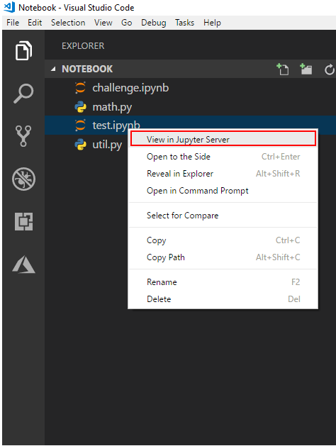

# Open jupyter notebooks in vscode
In this tutorial, we will open a jupyter notebook in vscodemodel.

## Prerequisites
Before you begin, ensure you have [set python path properly in vscode](https://code.visualstudio.com/docs/python/environments) and have already [installed jupyter in this python path with pip] (http://jupyter.org/install).

## Open a project

- Launch Visual Studio Code and select ***File > Open Folder*** (Ctrl+K Ctrl+Of)
- Select a folder which contains the jupyter notebook file (.pynb) you want to open.

## Select command in context menu

Right click the jupyter notebook file node and select **"view in jupyter server"** command.

## View and edit in vscode editor

After click the command, a jupyter server will start and show in right editor. You could view, edit and save your changes back to the file. 

